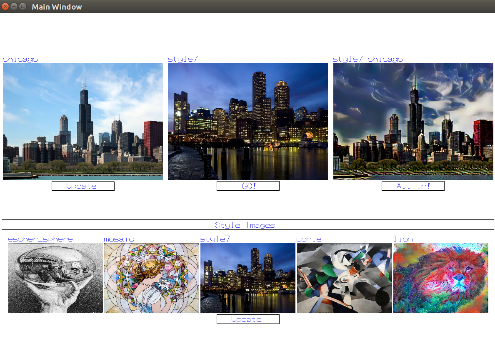

# Style Transfer using Adaptive Instance Normalization
The repository contains the code for tensorflow implementation of "Arbitrary Style Transfer in Real-time with Adaptive Instance Normalization" along with the C++ front end.  
Requirements:
1. Python 3.5+
2. Tensorflow
3. OpenGL

Our UI -  

